# ChatRoom

这个项目是计算机网络通信大作业的记录。在这个作业中将尝试实现一个简易的网络聊天室。

## 作业要求

### 项目任务

1. 一对一聊天程序：两个用户之间实现网络数据传输。
2. 多用户聊天程序：分为服务器与客户端，服务器能够支持多个用户之间的一对一聊天，实现网络数据传输（实现功能2即不必实现功能1）。工作过程：服务器启动后，侦听指定端口，客户端使用套接字传输消息，由服务器转发至另一客户端。
3. 文件传输：实现用户之间的文件传输，不限文件类型。
4. 扩展功能：参考现有聊天程序扩展功能（例如群组聊天、使用表情、语音聊天等）。

### 项目要求

1. 一人独立完成。
2. 可使用C/C++/C#/Java/Python等语言，Windows/Linux平台均可，可借助Socket类库。
3. 服务器与客户端可以是同一台电脑上的不同进程，也可以使用多台电脑/虚拟机实现。
4. 需要实现友好的用户界面。

## 项目环境

### 开发环境

本项目在Qt 5.12.11版本下开发完成，利用Qt MSVC编译工具链编译并生成可执行文件。

### 运行环境

在bin文件夹下已有在Windows10操作系统下编译生成的可执行文件，对应操作系统用户可直接下载运行。若是其他操作系统用户，可下载源码并本地利用Qt编译运行。

### 程序文件列表

```
source:.
├─ChatRoomClient
│  └─ChatRoomClient
│          chatroomclient.cpp
│          chatroomclient.h
│          ChatRoomClient.pro
│          ChatRoomClient.pro.user
│          chatroomclient.ui
│          connectdialog.cpp
│          connectdialog.h
│          createroomdialog.cpp
│          createroomdialog.h
│          main.cpp
│          multiusersdialog.cpp
│          multiusersdialog.h
│          singleuserdialog.cpp
│          singleuserdialog.h
│
└─ChatRoomServer
    └─ChatRoomServer
            chatroom.cpp
            chatroom.h
            chatroomserver.cpp
            chatroomserver.h
            ChatRoomServer.pro
            ChatRoomServer.pro.user
            chatroomserver.ui
            main.cpp
```

## 项目介绍

该项目利用Qt平台实现了一个简易的聊天室，包含群组聊天、发送文件、发送表情、实时查询聊天室用户等功能。

### 工作模型

该项目利用了典型的Client-Server工作模型支持运行。运行时需要一台主机运行服务端，其余用户根据服务端的ip地址和端口号进行连接。完成连接后聊天室内的用户可以通过客户端分享信息和文件等。

### 工作演示

#### 启动服务端和客户端


打开一个服务端和两个用户端如上图所示。

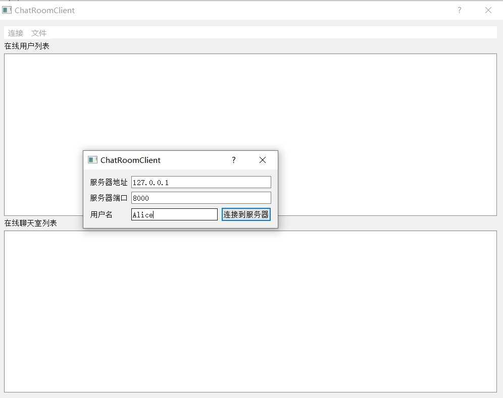

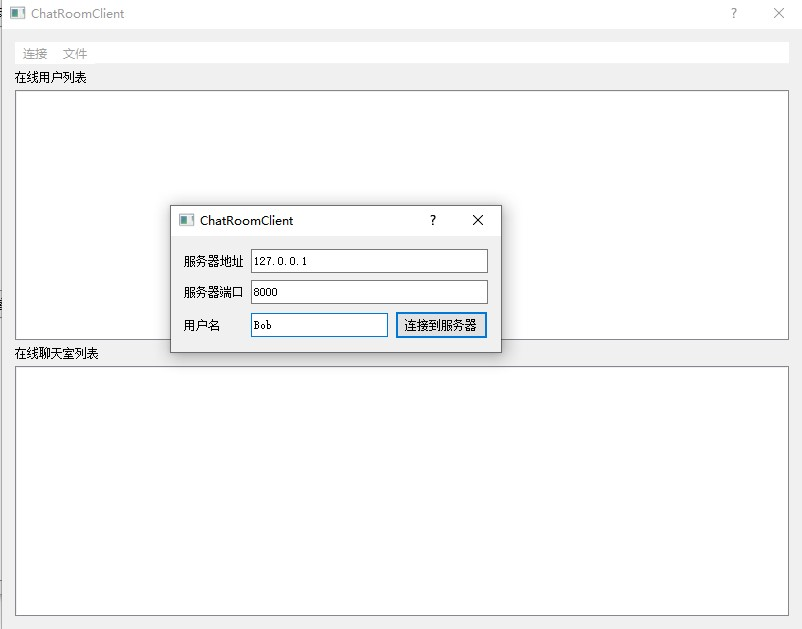


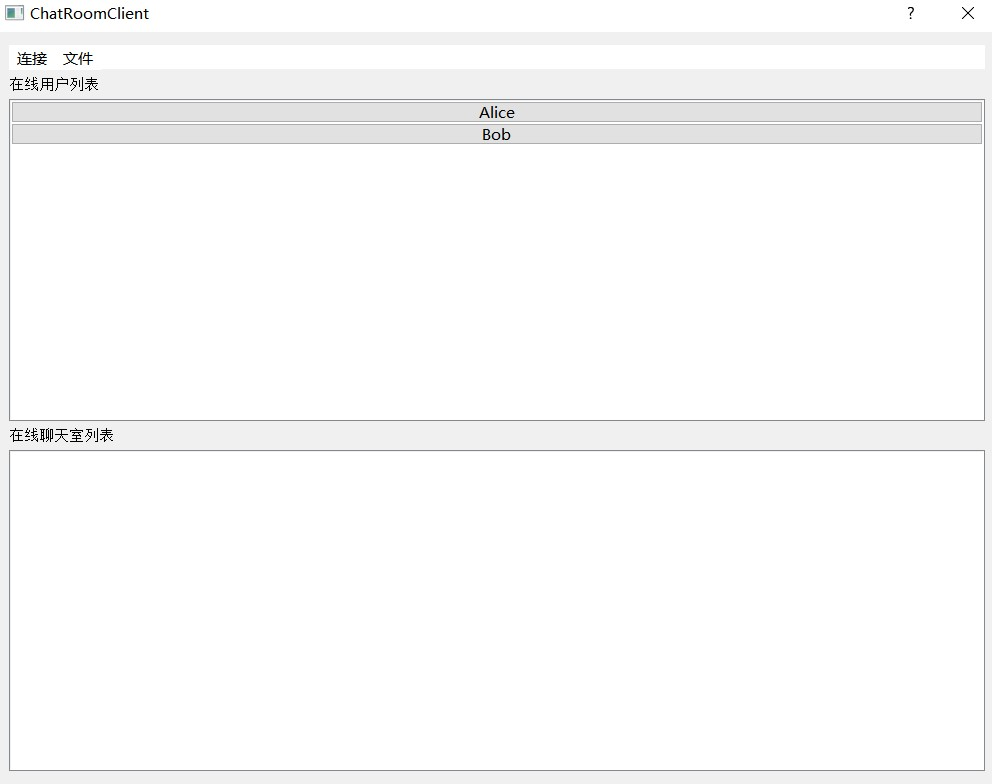

将两个客户端分别以Alice和Bob的用户名连接到服务端上，可以看到在服务端和用户端都显示了两个用户在线的情况。

#### 发送消息

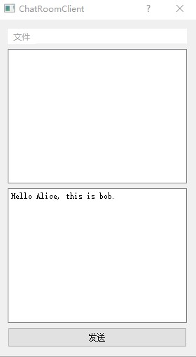

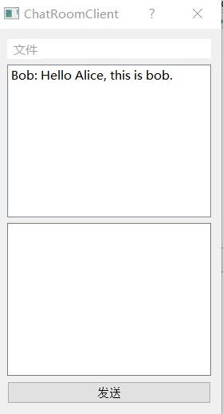

分别在两个客户端上点击对方名字打开头像，用Bob客户端向Alice客户端发送消息，可以看到Alice客户端成功接收了来自对方客户端的消息。

#### 发送文件

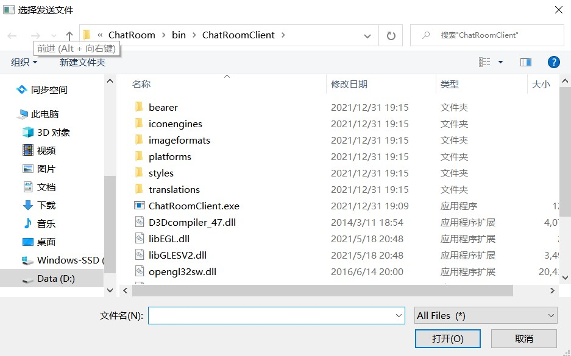

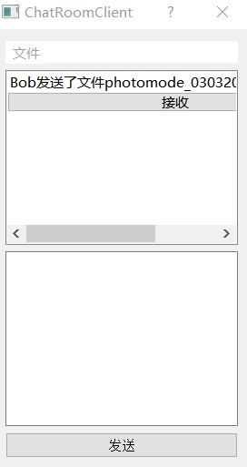

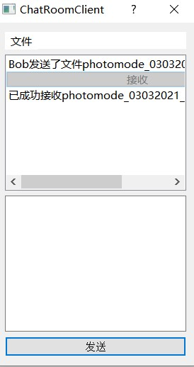


同上一步打开双方通信的对话，在Bob客户端选择发送本地文件并在本地选中，可以看到Alice客户端上出现了提示接收文件的消息，点击接收后进入本地文件夹查看发现获取文件成功。

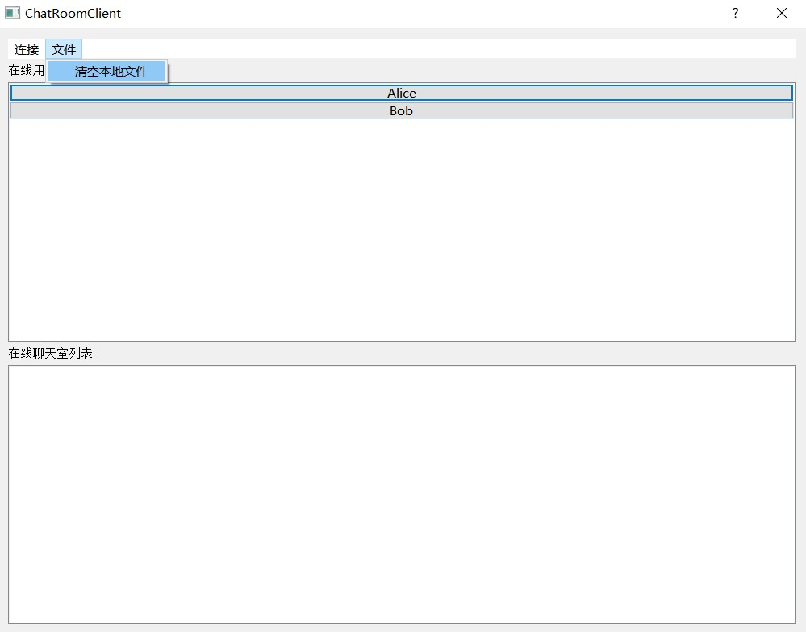

同时，也可以通过指定菜单栏选项清空本地缓存以节约空间。

#### 发送表情

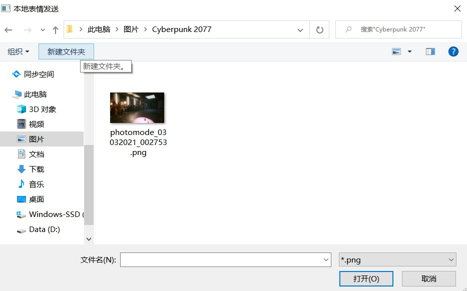

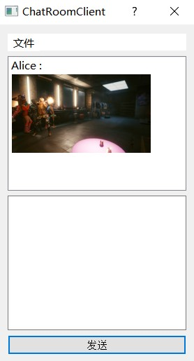

打开两个客户端，选择Bob客户端，选择一张本地图片进行发送，在Alice客户端成功接收到这张图片。目前支持的图片格式有png，jpg，jpeg和gif。项目针对gif进行了专门的设计，允许实时动态播放gif动画。

由于gif无法通过截图展示，故此处不进行单独演示。

#### 群组聊天

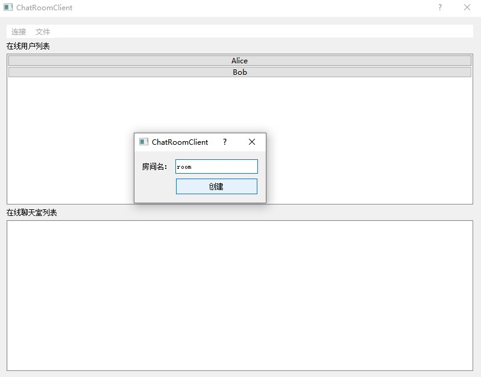

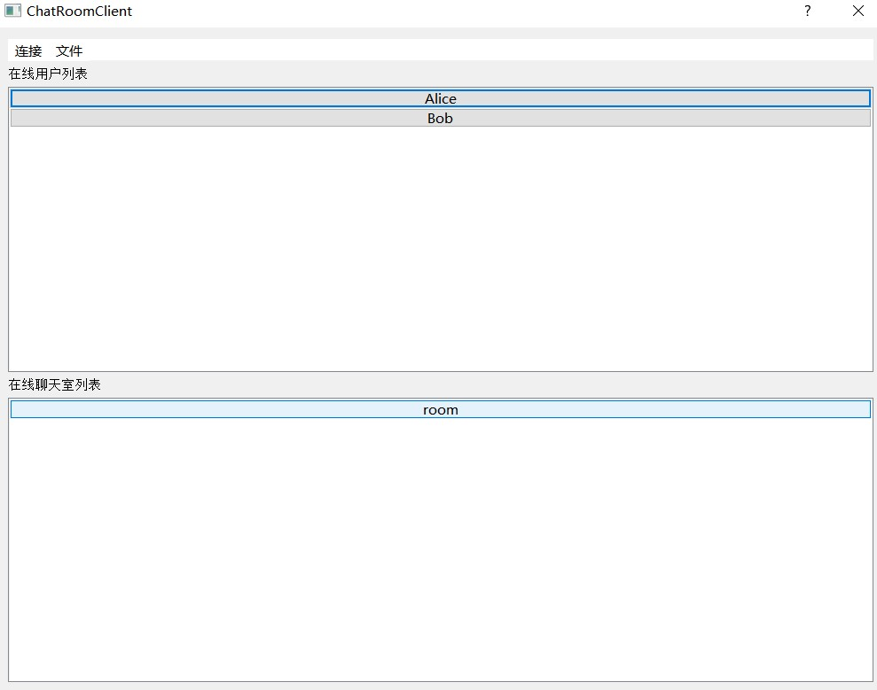

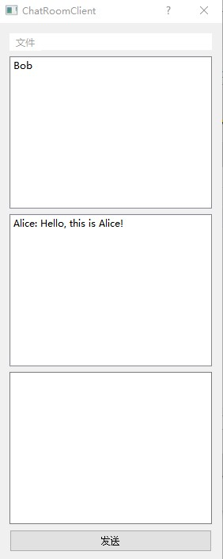

利用Bob客户端创建一个聊天室，在Alice客户端可以看见这个聊天室的存在。单击进入后发送消息，在Bob客户端上成功接收到了这条消息。

目前群组聊天也已支持本地图片发送功能，操作方法同一对一聊天相同。

### 工作原理

#### 数据结构

本次开发主要运用的数据结构大都直接利用或继承Qt的内置数据结构，并利用Qt的信号槽机制实现了不同功能组件之间的相互互动。

##### 客户端

客户端的主要结构为自定义的ChatRoomClient类，它继承自Qt内置类QDialog，结构如下

```c++
#ifndef CHATROOMCLIENT_H
#define CHATROOMCLIENT_H

#include <QDialog>
#include <QTcpSocket>
#include <QMenuBar>
#include <QMenu>
#include <QAction>
#include <QLabel>
#include <QListWidget>
#include <QVBoxLayout>
#include <QVBoxLayout>
#include <QJsonArray>
#include <QJsonDocument>
#include <QJsonObject>
#include <QJsonParseError>
#include <QMessageBox>
#include "connectdialog.h"
#include "singleuserdialog.h"
#include "createroomdialog.h"

QT_BEGIN_NAMESPACE
namespace Ui { class ChatRoomClient; }
QT_END_NAMESPACE

class ChatRoomClient : public QDialog
{
    Q_OBJECT

public:
    ChatRoomClient(QWidget *parent = nullptr);
    ~ChatRoomClient();

signals:
    void receiveRelatedText(QString, QString, QString, QString); // The third paramter is the name of room. Null string means that this message is sent to a single user.
    void receiveRelatedFile(QString, QString, QString, QString);
    void receiveRelatedReplyFile(QString, QString, QString, QString);
    void receiveRelatedImg(QString, QString, QString, QString);
    void updateRoomInfo(QString, QList<QString>);

public slots:
    void connectActionTriggered();
    void connectToServer(QString, int, QString);
    void disconnectToServer();
    void updateClient();
    void openSingleUserDialog();
    void closeSingleUserDialog(QString);
    void createRoom();
    void createMultiUsersDialogBtnClicked();
    void openMultiUsersDialog(QString);
    void closeMultiUsersDialog(QString);
    void clearLocalFiles();

private:
    Ui::ChatRoomClient *ui;
    const QString FLAG_RECEIVE = "Receive json.";
    QString userName;
    QTcpSocket *clientSocket;
    QMap<QString, SingleUserDialog *> singleUserDialogs;
    QMap<QString, MultiUsersDialog *> multiUsersDialogs;
    QMenuBar *menuBar;
    QMenu *connectMenu;
    QMenu *fileMenu;
    QAction *connectAction;
    QAction *disconnectAction;
    QAction *createRoomAction;
    QAction *clearFilesAction;
    QLabel *liveUserLabel;
    QListWidget *liveUserList;
    QLabel *liveRoomLabel;
    QListWidget *liveRoomList;
    QVBoxLayout *mainLayout;
};
#endif // CHATROOMCLIENT_H
```

在定义的私有成员中，大部分是用于ui设计的控件成员，其余FLAG_RECEIVE为一个固定回复报文，具体作用后文将会提及，userName用于存储用户的用户名，clientSocket为连接到服务器的套接字，singleUserDialogs和multiUsersDialogs存储了本地已打开的对话对象，便于在后续的程序中进行统一的对话管理。

```c++
#ifndef CHATROOMSERVER_H
#define CHATROOMSERVER_H

#include <QDialog>
#include <QTcpServer>
#include <QTcpSocket>
#include <QAction>
#include <QLabel>
#include <QListWidget>
#include <QVBoxLayout>
#include <QJsonArray>
#include <QJsonDocument>
#include <QJsonObject>
#include <QDir>
#include <QMessageBox>
#include <QThread>
#include "chatroom.h"

QT_BEGIN_NAMESPACE
namespace Ui { class ChatRoomServer; }
QT_END_NAMESPACE

class ChatRoomServer : public QDialog
{
    Q_OBJECT

public:
    ChatRoomServer(QWidget *parent = nullptr);
    ~ChatRoomServer();
    void updateLiveObjects();

public slots:
    void handleNewConnection();
    void handleNewData();
    void handleDisconnection();

private:
    Ui::ChatRoomServer *ui;
    const QString FLAG_RECEIVE = "Receive json.";
    unsigned int port;
    QTcpServer *serverSocket;
    QMap<QString, QTcpSocket *> users;
    QMap<QString, ChatRoom *> rooms;
    QAction *connectAction;
    QAction *disconnectAction;
    QLabel *liveUserLabel;
    QListWidget *liveUserList;
    QLabel *liveRoomLabel;
    QListWidget *liveRoomList;
    QVBoxLayout *mainLayout;
    void updateLocalLivaObjects();
};
#endif // CHATROOMSERVER_H
```

在定义的私有成员中，大部分是用于ui设计的控件成员，其余FLAG_RECEIVE为一个固定回复报文，具体作用后文将会提及，而port用于存储该服务端打开的端口号，serverSocket保存该服务端的监听套接字，users和rooms利用QMap数据结构实现了对所有在线用户和聊天室的统一管理。

##### 数据传输

数据传输依赖于json文件格式，大致如下

```json
{
    "sender":"sender's username", 
    "receiver":"receiver's username", 
    "contentType":"text/file/img", 
    "content":"The data of transmition or related information."
}
```

其中content可能为一个json object，包含了与文件相关的具体信息如文件名、大小等。

## 问题与解决

在开发过程中作者也遇到了许多问题，在这里对途中的问题和部分解决方案进行记录。

### 问题一

首先是初次使用Qt，Qt库内置丰富的控件和布局选项，但是也带来了我不熟悉这些类导致很多设想的界面工具无法正常使用的情况。

对于这样问题的解决方法主要在于大量的阅读Qt相关的教程文档，特别是CSDN上的很多分享贴为我掌握Qt提供了很大的帮助。

### 问题二

其次出现的一个问题是初期设计的不到位导致后期的修改出现很大的麻烦。一开始我的想法是依次完成作业的每一项要求，没有在开始进行代码编写之前确立好整个项目的工作模式，这在我依次完成作业要求的时候造成了非常大的麻烦。

首先比如整体的布局需要随着项目的进展逐渐向其中添加服务于不同功能的控件，但是由于缺乏前期的规划导致初次完成的外观布局十分混乱，界面上分布着大小各种的输入框和按钮，看上去不美观，于是后面我花费了大量的时间用于重新设计整理整个项目的外观布局，这本来是可以通过良好的前期设计一次开发避免的。

其次比如文件传输的设计。在开发文本传输功能的时候我直接利用字符串进行文本的分享，在这种情况下项目正常工作。但是在开发文件传输的时候由于文件过大受到TCP协议的限制，一个报文最多只能有65535字节的大小，所以过大的文件会被自动分片。如果直接发送文件内容的话，会导致接收方无法及时确认报文的接收因为其缺少确认报文完整性的手段。于是在文件数据报文发送之前会先发送一个json格式的报文用以告知对方文件的相关信息如文件名、文件大小等，然后接收方根据文件大小来判断自己接收的报文是否完整并且是否需要停止接收并进行下一步的处理。这样设计导致我初期文本发送等相关的内容也需要重新进行设计，并花费了我大量的时间在这上面。如果一开始能做好协议的设计这些重复工作完全可以避免。

### 问题三

在引入json格式的时候也出现了许多问题。发送文件时作者初期的构想是将文件数据直接添加到json文件中作为一部分进行传输，但是遇到了两个问题。首先是json文件本身不支持二进制数据的存储，这意味着无法直接将文件数据放入json中，后来的解决方法是base64编码，这种方式可以将二进制数据转换为对应的ASCII码，再利用字符串存储到json中，这是第一处问题。第二处问题在于如果直接放入json而不是分两步发送的话，无法提前将数据包大小通知到接收方，导致了接收方无法对接收到的json文件的完整性进行确认，这一问题的解决方法是倒回问题二中的方案，分两步分发报文，先利用一个小的json文件通知相关信息再发送相应的二进制数据。

### 问题四

在进行文件处理的时候作者又发现出现了粘包的情况，意思是指本地程序读取socket的时候无法区分缓冲区内的数据，有可能误把两次发送的数据合并处理当作一次处理从而导致解析数据失败。作者在读取相关的文档之后采用了手动沉睡线程的方法强行在发送时制造时间差，但是这样的方法一方面降低效率另一方面会导致短暂的卡顿（虽然很不明显），经过思考后认为学习ftp协议另开端口进行数据传输可能是更好的解决方案，但是因为时间原因无法进行尝试，可以留作以后的改进空间。

### 问题五

由于该项目需要大量的对话窗口进行协作，因此其中使用了大量的信号槽进行不同对话窗口的通信，这也导致了一定程度上的混乱。在实际的开发中需要提前进行架构的设计和规划以避免后期这种情况的出现。

### 问题六

在实现本地表情包的展示特别是gif的实时播放上也花费了很多的功夫，查阅了大量的文档和相关的资料找到了对应的类支持相关功能的实现。

### 其余

开发过程中还有很多剩余的小问题，本处不再一一提及。

## 未来与展望

对于目前开发的项目还存在不足之处，这在未来可以继续改进。首先是现有的程序都是工作在单线程模式下，服务端处理大规模并发的能力有待检验，并且单一功能的崩坏很有可能导致整体程序的崩溃。其次是UI界面仍然有待优化和改进的空间。最后是上文提到的文件传输的可能的优化方案。

## 体会与建议

我认为这次大作业是一次很好的经历，成功地将课堂上学习到的有关计算机网络的知识运用在了实际的项目中，对我进一步加深对有关知识的理解发挥了很大的作用。比如文件传输时的分片机制让我认识到一开始的实现失败的原因并为我之后重写这一部分的内容提供了相关的指导。

在项目开发的过程中我也体会到了在实际的工程项目中良好的前期规划的工程管理对于项目开发带来的巨大帮助，添加注释、及时形成文档、合理使用git进行版本管理等都是需要在未来养成的良好习惯，这样宝贵的经验对于我未来的开发工作裨益良多。

最后是借此机会学习了Qt库，了解了一般桌面应用开发和前端设计的逻辑和方法，特别是Qt的信号槽机制对我触动很深刻，改变了我以往对于C++和事件驱动型编程的认知。阅读大量的文档、教程和经验贴也很大地提升了我相关的学习能力。

对于大作业的建议，我认为老师在进行大作业任务布置时可以对每项作业的核心思路和比较常用的工具进行一些简单的介绍，这样在我们进行相关资料的搜索和学习时能够指明简单的方向，而不是在网上搜索到很多无关的信息如同一个无头苍蝇一样乱撞。

## 附录

GitHub地址：https://github.com/sgjzfzzf/ChatRoom